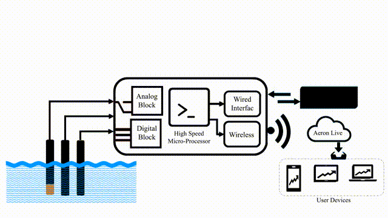
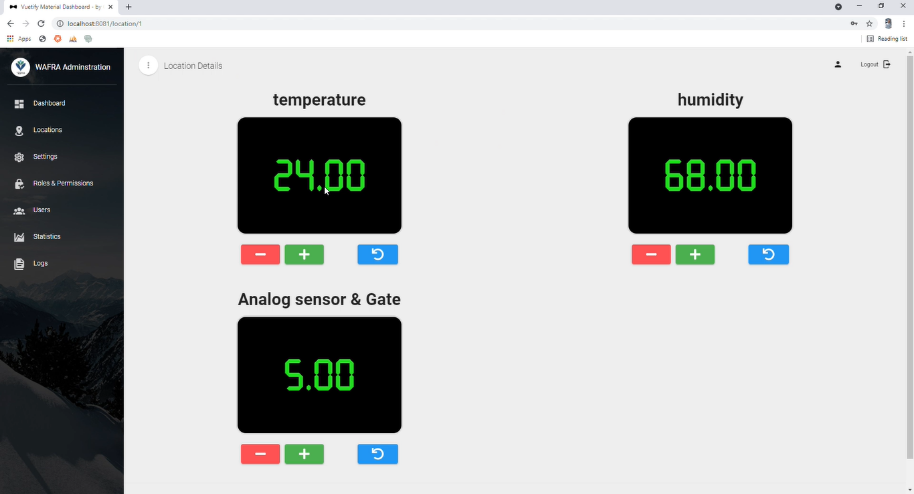
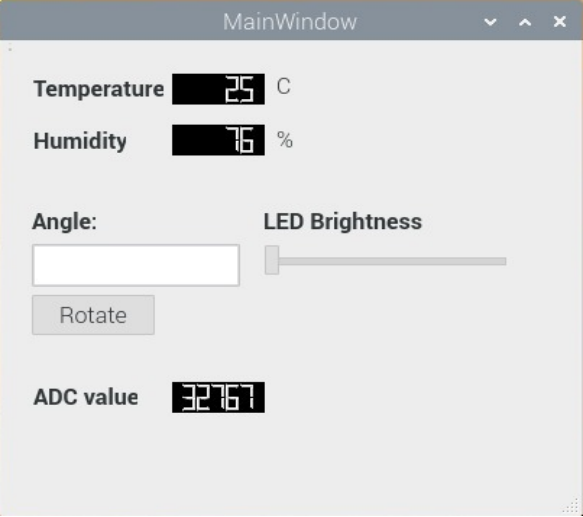

 &nbsp;
  &nbsp; 
 &nbsp;
 &nbsp; 
 &nbsp;
 &nbsp; 
 &nbsp;

 
&nbsp;&nbsp;&nbsp;&nbsp;&nbsp;&nbsp;&nbsp;&nbsp;&nbsp;&nbsp;&nbsp;&nbsp;&nbsp;&nbsp;&nbsp;&nbsp;&nbsp;&nbsp;&nbsp;&nbsp;&nbsp;&nbsp;&nbsp;&nbsp;&nbsp;&nbsp;&nbsp;&nbsp;&nbsp;&nbsp;&nbsp;&nbsp;&nbsp;&nbsp;&nbsp;&nbsp;&nbsp;&nbsp;&nbsp;&nbsp;
[](https://www.python.org/downloads/release/python-370/) &nbsp;&nbsp;&nbsp;&nbsp;
 &nbsp;&nbsp;&nbsp;&nbsp;
 &nbsp;&nbsp;&nbsp;&nbsp;


<!--[](https://www.python.org/) -->


## Table of contents
* [General info](#general-info)
* [Technologies and Tools](#technologies-and-tools)
* [Setup](#setup)
* [Run](#run)
* [System Aechitecture](#system-network)
* [Control Server](#control-server)
* [System Network](#system-network)
* [Dashboard](#dashboard)
* [GUI Application](#gui-application)
* [Demo](#live-demo)


## General info
<p align="center">
  
</p> 

<p>The main goal of WAFRA is to develop a smart sustainable aquaponic system, monitored and controlled through photovoltaic powered remote sensing. The system would contribute to socio-economic growth and create new jobs in remote areas through offering a complete system that starts with training trainers and/or individuals on system operation and proposing a cost benefit analysis to start the system.</p>
<p>Here in this repository we are developing:</p>

* On-line monitoring system for water quality and system efficiency by developing a web server and installing it on an embedded board which will provide a service to collect sensors data and perform control actions.
* GUI application which will be installed in HMI(Human Machine Interface) in ecah field location.
<br/>

## Technologies and tools 
- Programming language: Python
- Development board: Raspberry PI 
- Framworks and libraries: Flask, PyQt5, hashlib, threading
- Database: SQLite
- Operating System: Rasbian(Debian-based OS)
- Source Code Management: GIT  
- Other tools: Postman, SSH, Remote Desktop Connection
<br/>

## Setup
- To install dependencies for this project, run this bash script on your Raspberry Pi:
```
$ ./setup.sh
```
<br/>

## Run 
Go to the project directory and run the following command to run the server 
```
$ flask run -h <ip>:<port>
```
<br/>

## System Architecture
<br/>
<p align="center">
  
</p> 
<br/>


## Control Server
 <br/>
<p align="center">
  
</p> 
<br/>

## System Network
<br/>
<p align="center">
  
</p> 
<br/>

## Dashboard
</br>
<p align="center">
  
</p> 
<br/>

## GUI Application
<br/>
<p align="center">
  
</p> 
<br/>

## Live Demo

	
